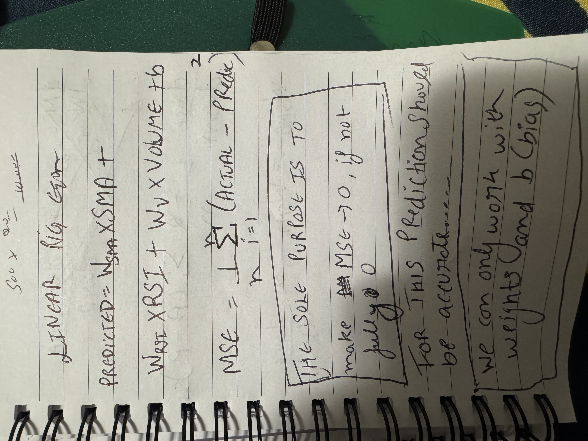
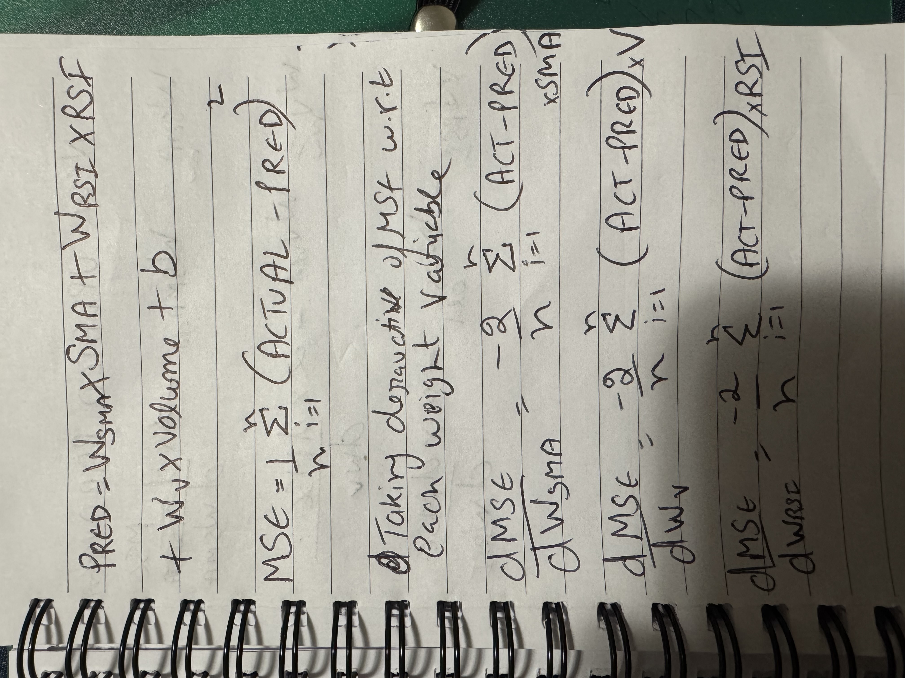
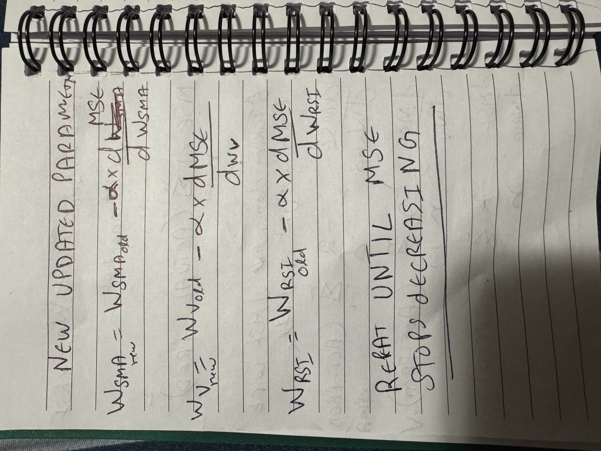
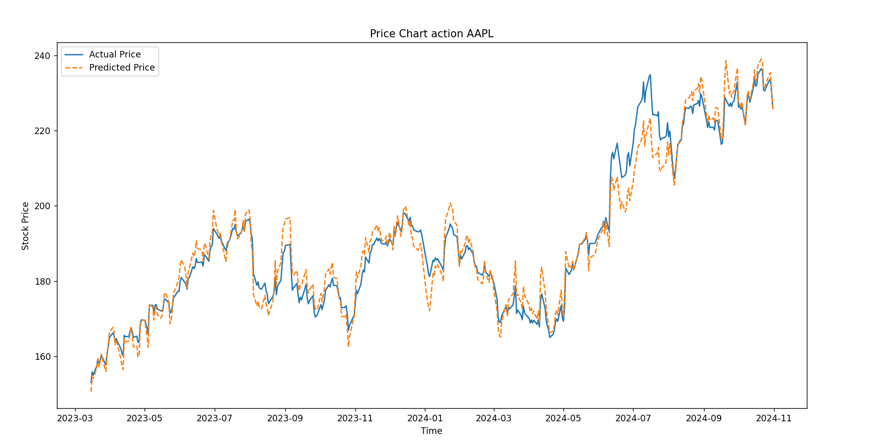
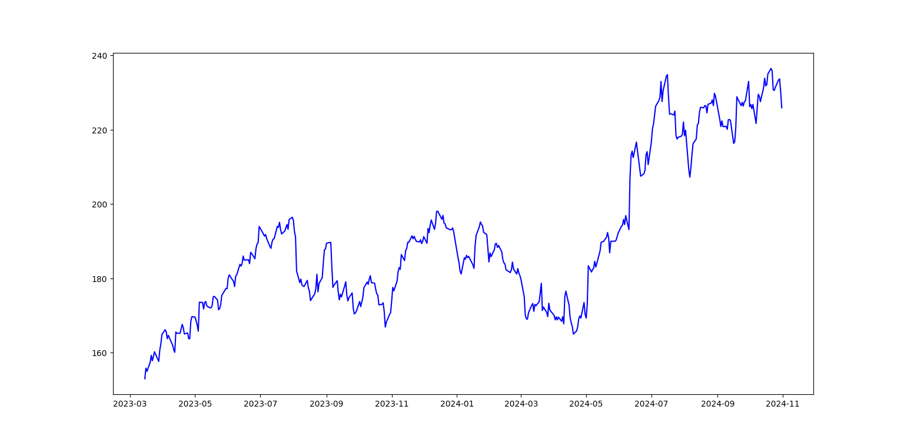
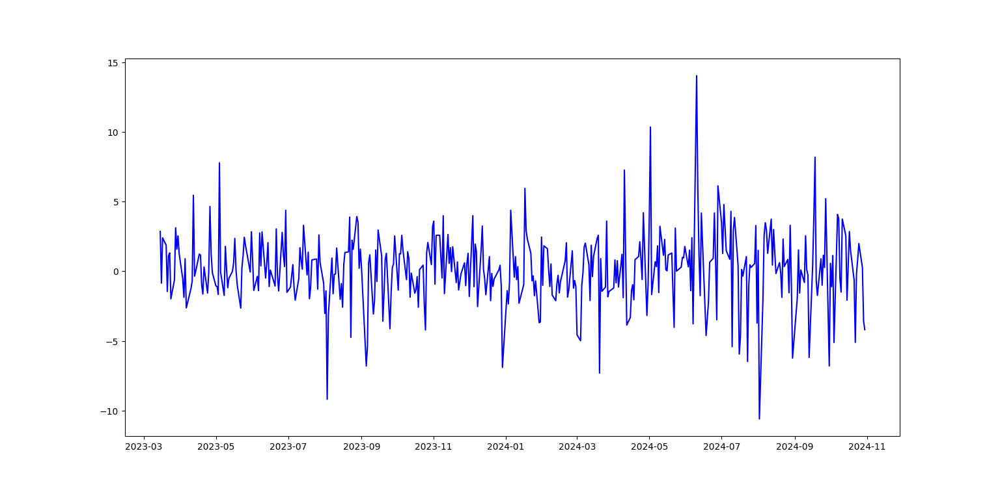
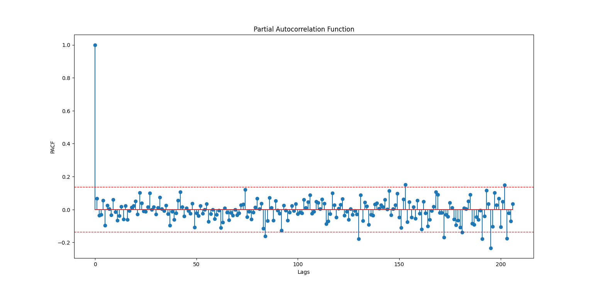
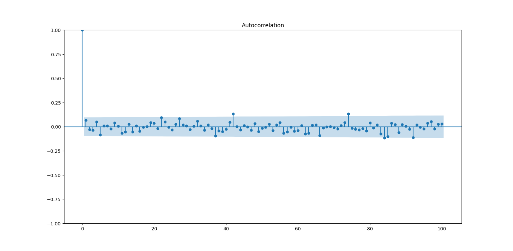
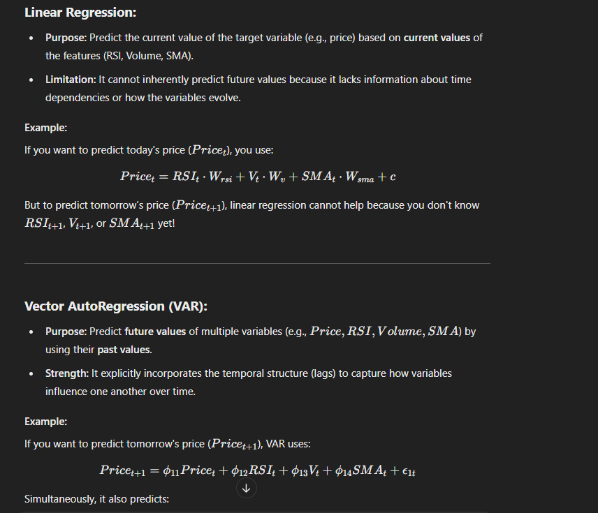
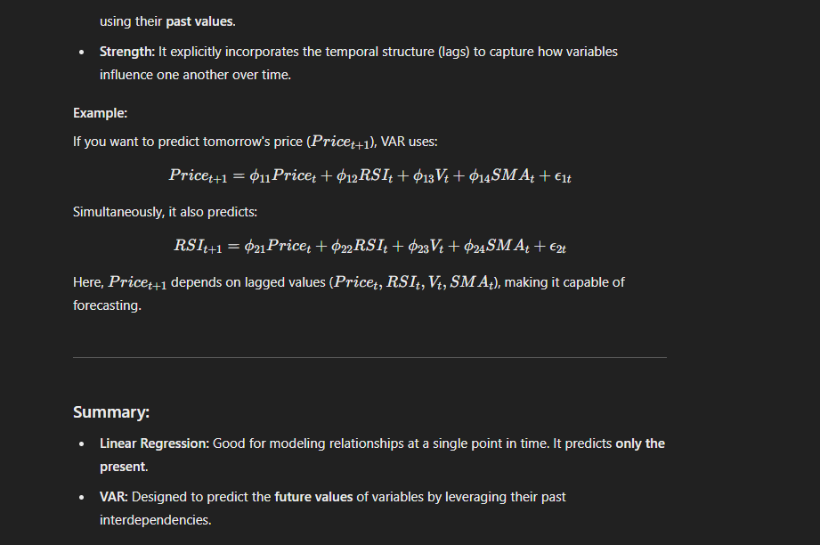

# Complete Plan
## Collection of data
Stock History: This can be acquired using yfinance API. I can get historical information and various indicators from this website. Even, I can produce my own indicators.

News Data: I need to gather news about particular stock. Need to check what API I can use...

Fundamental Data: This includes earning and Quarterly reports. This information can be gathered using yfinance API as well.

## Choice of model
### Version 1
Start with Linear regression model and see how it works
The weights should be following:
a. RSI
b. Volume
c. SMA

Using gradient descent of MSE (Mean Squared Error) on provided weights, I will try to minimize the error between predicted and actual value.

#### Result of V1

#### Generating the future data
### Trying with ARIMA

To generate the future data, we have to use time series analysis to analyze what effect would previous lags have on future data.
- Plot the PACF chart of each feature

Starting with Close Price first: 
The data is not stationary

Using Differencing method for making the data stationary:

PACF CHART

ACF CHART

None of the lag shows any strong relationship between current and previous value.

#### Conclusion
ARIMA is not good enough to predict future value as it is univariate means it does not take into consideration the effect of other features.. So we need something in which we can get how multiple features can affect the resultant value. So we will try VAR (Vector Auto Regression) next.

### Trying with VAR - Vector Auto Regression

Main Difference between VAR and Linear Regression is following

[VAR MODEL](https://onedrive.live.com/view.aspx?resid=34F345C4C190C44C%21260377&id=documents&wd=target%28TimeSeries.one%7CE31946B6-70CD-4672-B954-6576264862C3%2F%29)

Data has been stationarized and PACF plot has been plotted to calculate lag values

After doing the prediction, predicted value is coming out to be $222.611 whereas on Nov 1st the Close price was $222.91
