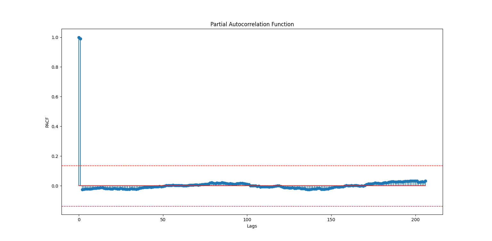

# Complete Plan
## Collection of data
Stock History: This can be acquired using yfinance API. I can get historical information and various indicators from this website. Even, I can produce my own indicators.

News Data: I need to gather news about particular stock. Need to check what API I can use...

Fundamental Data: This includes earning and Quarterly reports. This information can be gathered using yfinance API as well.

## Choice of model
### Version 1
Start with Linear regression model and see how it works
The weights should be following:
a. RSI
b. Volume
c. SMA

Using gradient descent of MSE (Mean Squared Error) on provided weights, I will try to minimize the error between predicted and actual value.

#### Result of V1

#### Generating the future
To generate the future data, we have to use time series analysis to analyze what effect would previous lags have on future data.
- Plot the PACF chart of each feature
PACF of SMA is not giving much insights

PACF of Close Price: First the Close price has been stationarized and then PACF has been ploted for that data
